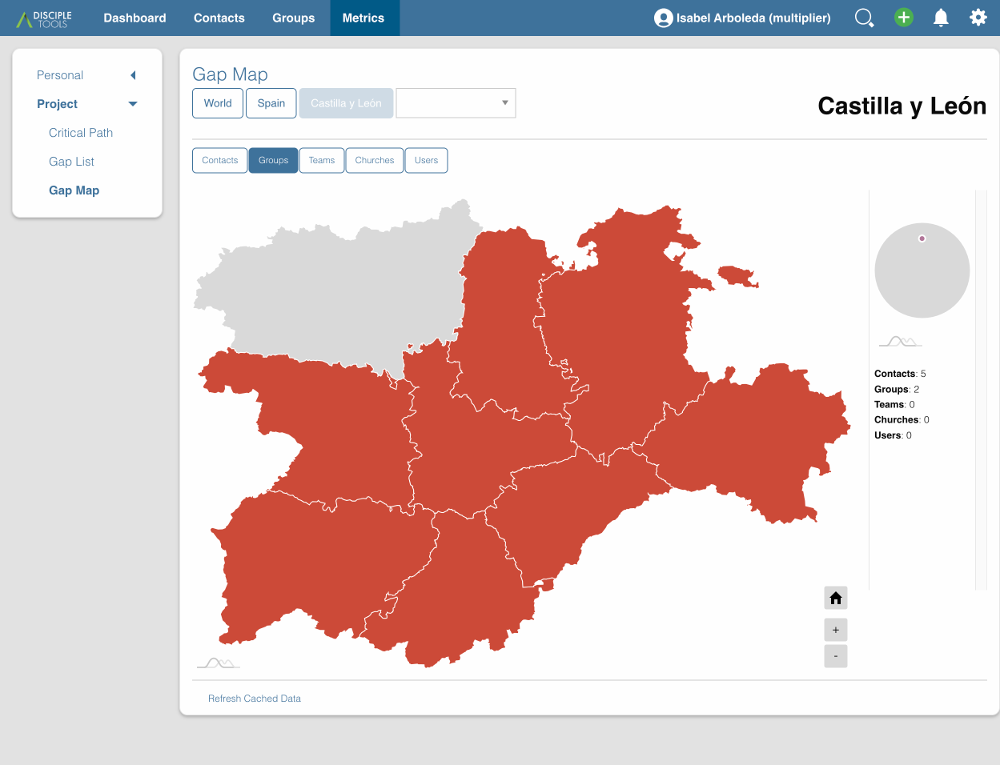
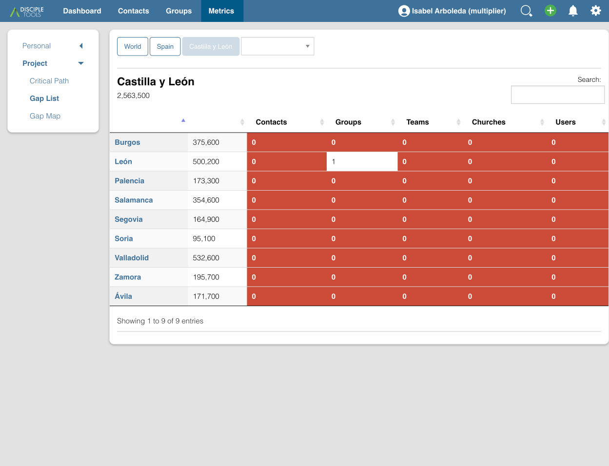

# Disciple.Tools - Metrics Gap List

Visualize the Gaps in Gospel Saturation

## Purpose

When tracking contacts and groups to monitor Gospel saturation in a given area,
you want to see [where the Kingdom isn't](https://zume.training/eyes-to-see-where-the-kingdom-isnt/).

> Every disciple needs to be equipped to see where the Kingdom isn’t. There are places all around us where God’s will is not being done on earth as it is in heaven. There are giant gaps where brokenness, pain, persecution, suffering and even death are a part of normal, everyday life. Those gaps are what we are to work on closing in our labors for the Kingdom while we are on this earth.
>
> \- Zume

Existing metrics in Disciple.Tools show where you do have contacts, groups and churches,
but it doesn't specifically highlight where there ISN'T Kingdom impact happening.
This plugin adds a Gap List - both as a map and a flat list of locations - so that you
can prioritize your Kingdom efforts.

## Usage

#### Will Do

- Adds Gap Map (Metrics -> Project)
- Adds Gap List (Metrics -> Project)
- Shows Gaps for Contacts, Groups, Teams, and Churches
- Supports deep diving into any administrative level support by your site's location list
- Makes Gap Map/List visible to all Multiplier users, as well as any users who already have Project Metrics access

#### Will Not Do

- Expose contact/group details to multiplier users
- Modify contact/group post types
- Integrate with Network Dashboard

## Requirements

- Disciple.Tools Theme installed on a Wordpress Server

## Installing

- Install as a standard Disciple.Tools/Wordpress plugin in the system Admin/Plugins area.
- Requires the user role of Administrator.

## Contribution

Contributions welcome. You can report issues and bugs in the
[Issues](https://github.com/cairocoder01/dt-metrics-gap-list/issues) section of the repo. And
code contributions are welcome using the [Pull Request](https://github.com/cairocoder01/dt-metrics-gap-list/pulls)
system for git. For a more details on contribution see the
[contribution guidelines](https://github.com/cairocoder01/dt-metrics-gap-list/blob/master/CONTRIBUTING.md).

## Screenshots

